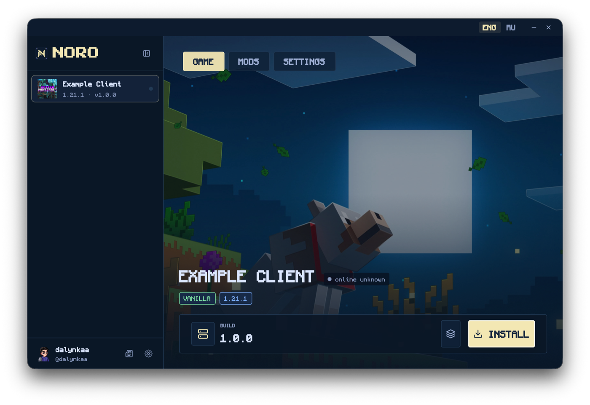
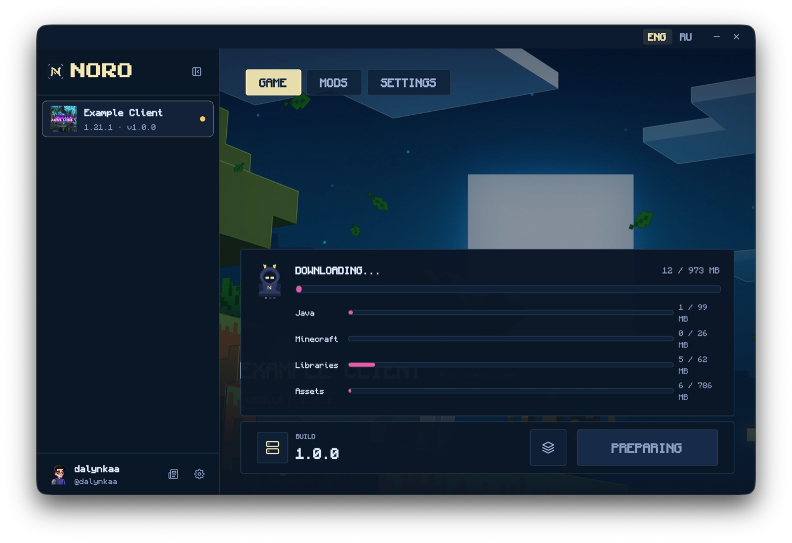
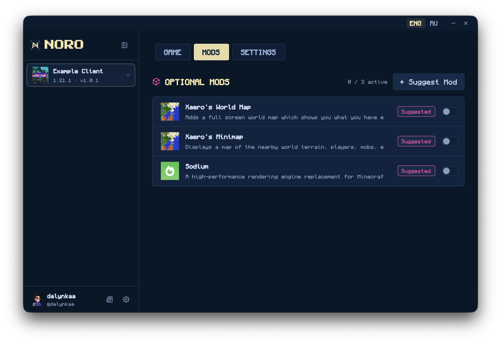
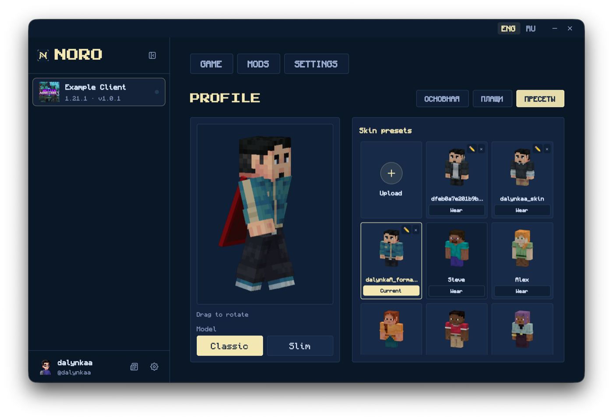
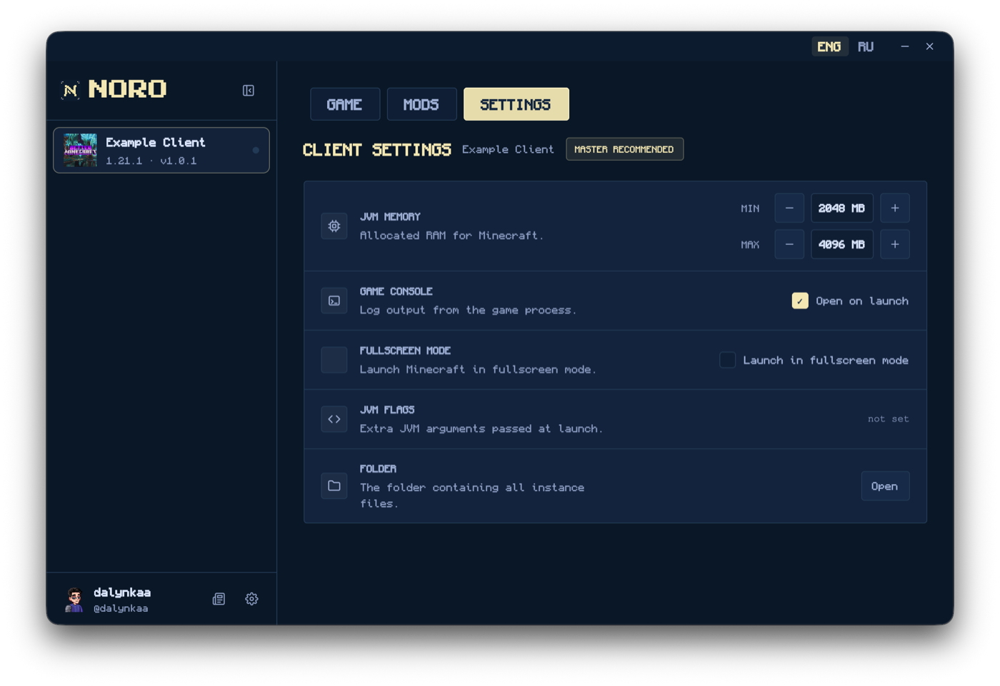

# Noro Launcher

A fast, lightweight launcher for the Noro Minecraft network. It installs the game
for you, keeps it up to date, and starts it — you pick a server and press play.

No manual mod installing, no version juggling, no "which folder does this file go
in". If the server adds a mod tomorrow, the launcher notices and downloads it
before the game starts.

## What it does

**Opens straight away.** It's a real program for your computer, not a web page
wrapped in a window. The interface is drawn by your graphics card, so scrolling
and animations stay smooth even on an old laptop.

**Barely touches your memory.** Launchers built on web technology can take
hundreds of megabytes just to show you a button. This one is a fraction of that,
which matters most while you play: the launcher isn't competing with Minecraft
for the RAM you gave it.

**Installs everything itself.** Java, Minecraft, the mods, the textures — all of
it. You don't need Java installed, and you don't need to know which version the
server runs.

**Keeps you in sync.** Every time you press play, it checks that your files match
the server's. If something changed, only the changed parts are downloaded, not
everything again.

**One button.** The same button says *Install* the first time, *Update* when
there's something new, and *Start game* the rest of the time.

**Optional mods.** Some mods are up to you — minimaps, sound tweaks, quality of
life things. Turn them on or off; the required ones are handled for you.

**Your skin and capes.** Upload a skin, save several and switch between them, put
on a cape you've earned. You see how it looks before anyone else does.

**Settings that matter, and no more.** How much memory the game gets, fullscreen
or not, where the files live. If you've never touched these, the defaults are
fine.

**News from the network.** Server announcements show up in the launcher, so you
don't have to go looking for them.

**It updates itself.** New launcher versions install with one click.

## Getting started

1. Download the launcher for your system — Windows, macOS or Linux.
2. Open it and sign in.
3. Pick a server from the list on the left.
4. Press the button.

The first launch takes a while: it's downloading Minecraft, Java and the mods.
After that, starting the game is quick — only what actually changed gets
downloaded.

## If something goes wrong

**The game won't start, or something looks broken.** Open Settings and use
**Report a problem**. That sends the last session's logs to the admins so they
can see what happened. Your worlds, screenshots and server list are never
included, and your username and login tokens are removed before anything is sent.

**The launcher itself crashed.** It can send an anonymous report so the crash
gets fixed. There's no account name and no machine name in it, and you can turn
this off in Settings.

Neither of these happens without you knowing.

## Privacy

The launcher talks to the Noro network to sign you in, list servers and fetch
game files. It doesn't read your worlds, your screenshots, or anything outside
its own folder.

## Licence

Free and open source, under the [GNU AGPL-3.0](LICENSE). You can read the code,
change it, and run your own copy.

The **name Noro and the logo** are a separate matter — see
[TRADEMARK.md](TRADEMARK.md). Short version: build on this all you like, just
don't release it under our name, so players always know whose launcher they're
running.

## For developers

How it's put together, how to build it and how releases work — all in
[CONTRIBUTING.md](CONTRIBUTING.md). Pull requests are welcome.
